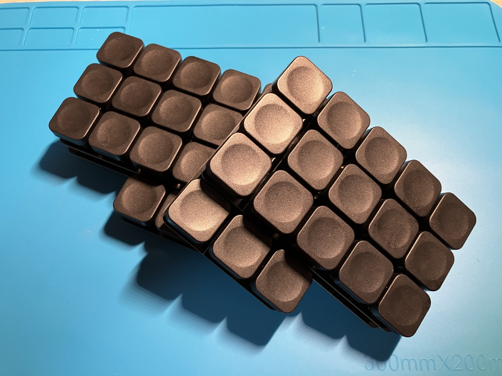
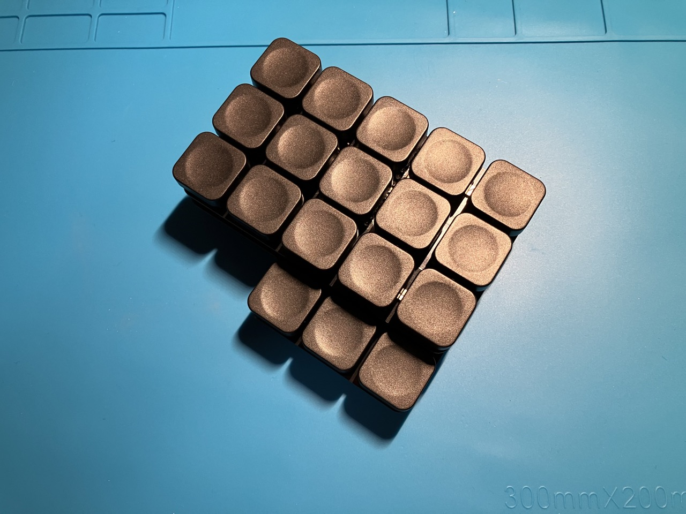

# Bloq

I've wanted to create a minimal looking keyboard (meaning the MCU had to be below the keys and the pcb would not protrude beyond the keycaps) that had a lowered thumb cluster, a separate PCB, and be both Choc and MX compatible ever since I fell into this deep rabbit hole of ergonomic keyboards (and after getting some inspiration from u/ak66666 and his stacked "Thumbs Up!" keyboards).

And so the Bloq was born!

This is just another example of how everyone's needs and preferences are unique and different. For me, this keyboard is very satisfying to use and has everything I need for programming and typing on 36 keys. The peculiar lowered thumb cluster allows me to comfortably use it in a tilted (45deg) orientation. The only drawback of making it both Choc and MX is that the distance between the keys is a bit uncomfortable, so I'll probably be making a Chocofi-like minimal board with Chosfox keycaps as well.

## Specifications & Info:

- Choc/MX compatible
- Hotswap
- Two-part PCB
- Puck/tenting support
- Wireless (only!)
- Keymap [here](keymap/README.md)
- PCB [here](pcb/)
- ZMK repo [here](https://github.com/kunsteak/zmk-config-bloq)

### Things I wanted ta achieve with this project:

- [x] Make the main PCB symmetrical (no need to make it reversible + cost cut)
- [x] Make it a two-part build (lower part reversible)
- [x] Have the MCU be under the switches

## Pictures

## Sponsorship

I was very fortunate to have this project of mine (and a few others) be not only noticed and approved, but also sponsored by [PCBWay](https://www.pcbway.com). They have kindly provided me with the two PCBs for this keyboard build in a high-quality immersion gold (ENIG) finish. This was my first ever sponsorship, as well as my first ever PCBWay order.

Although on the pricier side, these PCBs are perfect for an Endgame build, as they look and feel very premium. Both the product and the customer service has been very satisfactory and I will certainly keep ordering from PCBWay in the future.

If you'd like an extra 5$ on your first order when signing up on PCBWay you can use [this](https://pcbway.com/g/dh9XKF) referral link of mine to get started. If you choose to do so, I receive a 10$ coupon from PCBWay and am eternally grateful for your kind gesture.
