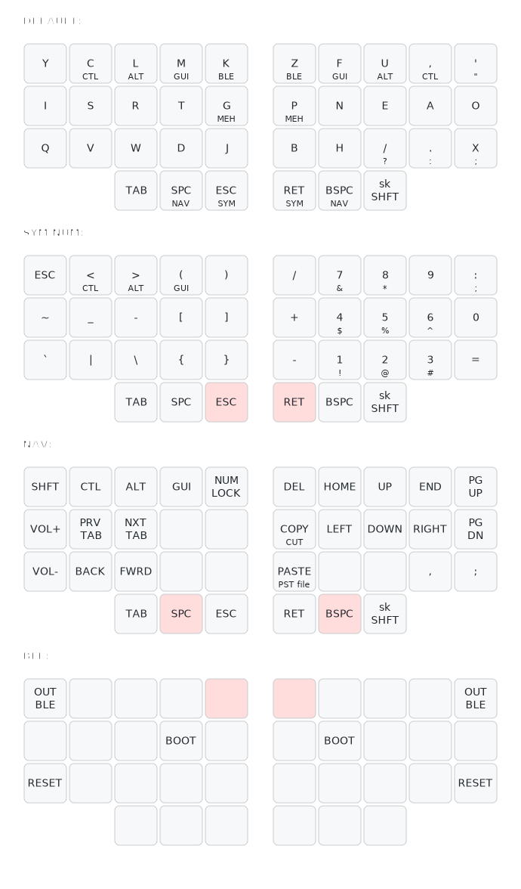

## TODO:

- [ ] Add mouse buttons
- [ ] Add scroll up/down

Paste the contents of the following code block into [keymap-drawer](https://caksoylar-keymap-drawer-streamlitapp-2a0rau.streamlit.app) to edit the keymap.

```
# bloq keymap
layout:
  ortho_layout:
    split: true
    rows: 3
    columns: 5
    thumbs: 3
layers:
  DEFAULT:
    # left upper five (0.0 - 0.4)
    - { t: "Y", h: "" }
    - { t: "C", h: "CTL" }
    - { t: "L", h: "ALT" }
    - { t: "M", h: "GUI" }
    - { t: "K", h: "BLE" }
    # right upper five (0.5 - 0.9)
    - { t: "Z", h: "BLE" }
    - { t: "F", h: "GUI" }
    - { t: "U", h: "ALT" }
    - { t: ",", h: "CTL" }
    - { t: "'", h: '"' }
    # left home five (1.0 - 1.4)
    - { t: "I", h: "" }
    - { t: "S", h: "" }
    - { t: "R", h: "" }
    - { t: "T", h: "" }
    - { t: "G", h: "MEH" }
    # right home five (1.5 - 1.9)
    - { t: "P", h: "MEH" }
    - { t: "N", h: "" }
    - { t: "E", h: "" }
    - { t: "A", h: "" }
    - { t: "O", h: "" }
    # left lower five (2.0 - 2.4)
    - { t: "Q", h: "" }
    - { t: "V", h: "" }
    - { t: "W", h: "" }
    - { t: "D", h: "" }
    - { t: "J", h: "" }
    # right lower five (2.5 - 2.9)
    - { t: "B", h: "" }
    - { t: "H", h: "" }
    - { t: "/", h: "?" }
    - { t: ".", h: ":" }
    - { t: "X", h: ";" }
    # thumbs
    - { t: "TAB", h: "" }
    - { t: "SPC", h: "NAV" }
    - { t: "ESC", h: "SYM" }
    - { t: "RET", h: "SYM" }
    - { t: "BSPC", h: "NAV" }
    - { t: "sk SHFT", h: "" }
  SYM/NUM:
    # left upper five (0.0 - 0.4)
    - { t: "ESC", h: "" }
    - { t: "<", h: "CTL" }
    - { t: ">", h: "ALT" }
    - { t: "(", h: "GUI" }
    - { t: ")", h: "" }
    # right upper five (0.5 - 0.9)
    - { t: "/", h: "" }
    - { t: "7", h: "&" }
    - { t: "8", h: "*" }
    - { t: "9", h: "" }
    - { t: ":", h: ";" }
    # left home five (1.0 - 1.4)
    - { t: "~", h: "" }
    - { t: "_", h: "" }
    - { t: "-", h: "" }
    - { t: "[", h: "" }
    - { t: "]", h: "" }
    # right home five (1.5 - 1.9)
    - { t: "+", h: "" }
    - { t: "4", h: "$" }
    - { t: "5", h: "%" }
    - { t: "6", h: "^" }
    - { t: "0", h: "" }
    # left lower five (2.0 - 2.4)
    - { t: "`", h: "" }
    - { t: "|", h: "" }
    - { t: "\\", h: "" }
    - { t: "{", h: "" }
    - { t: "}", h: "" }
    # right lower five (2.5 - 2.9)
    - { t: "-", h: "" }
    - { t: "1", h: "!" }
    - { t: "2", h: "@" }
    - { t: "3", h: "#" }
    - { t: "=", h: "" }
    # thumbs
    - { t: "TAB", h: "" }
    - { t: "SPC", h: "" }
    - { t: "ESC", h: "", type: held }
    - { t: "RET", h: "", type: held }
    - { t: "BSPC", h: "" }
    - { t: "sk SHFT", h: "" }
  NAV:
    # left upper five (0.0 - 0.4)
    - { t: "SHFT", h: "" }
    - { t: "CTL", h: "" }
    - { t: "ALT", h: "" }
    - { t: "GUI", h: "" }
    - { t: "NUM LOCK", h: "" }
    # right upper five (0.5 - 0.9)
    - { t: "DEL", h: "" }
    - { t: "HOME", h: "" }
    - { t: "UP", h: "" }
    - { t: "END", h: "" }
    - { t: "PG UP", h: "" }
    # left home five (1.0 - 1.4)
    - { t: "VOL+", h: "" }
    - { t: "PRV TAB", h: "" }
    - { t: "NXT TAB", h: "" }
    - { t: "", h: "" }
    - { t: "", h: "" }
    # right home five (1.5 - 1.9)
    - { t: "COPY", h: "CUT" }
    - { t: "LEFT", h: "" }
    - { t: "DOWN", h: "" }
    - { t: "RIGHT", h: "" }
    - { t: "PG DN", h: "" }
    # left lower five (2.0 - 2.4)
    - { t: "VOL-", h: "" }
    - { t: "BACK", h: "" }
    - { t: "FWRD", h: "" }
    - { t: "", h: "" }
    - { t: "", h: "" }
    # right lower five (2.5 - 2.9)
    - { t: "PASTE", h: "PST file" }
    - { t: "", h: "" }
    - { t: "", h: "" }
    - { t: ",", h: "" }
    - { t: ";", h: "" }
    # thumbs
    - { t: "TAB", h: "" }
    - { t: "SPC", h: "", type: held }
    - { t: "ESC", h: "" }
    - { t: "RET", h: "" }
    - { t: "BSPC", h: "", type: held }
    - { t: "sk SHFT", h: "" }
  BLE:
    # left upper five (0.0 - 0.4)
    - { t: "OUT BLE", h: "" }
    - { t: "", h: "" }
    - { t: "", h: "" }
    - { t: "", h: "" }
    - { t: "", h: "", type: held }
    # right upper five (0.5 - 0.9)
    - { t: "", h: "", type: held }
    - { t: "", h: "" }
    - { t: "", h: "" }
    - { t: "", h: "" }
    - { t: "OUT BLE", h: "" }
    # left home five (1.0 - 1.4)
    - { t: "", h: "" }
    - { t: "", h: "" }
    - { t: "", h: "" }
    - { t: "BOOT", h: "" }
    - { t: "", h: "" }
    # right home five (1.5 - 1.9)
    - { t: "", h: "" }
    - { t: "BOOT", h: "" }
    - { t: "", h: "" }
    - { t: "", h: "" }
    - { t: "", h: "" }
    # left lower five (2.0 - 2.4)
    - { t: "RESET", h: "" }
    - { t: "", h: "" }
    - { t: "", h: "" }
    - { t: "", h: "" }
    - { t: "", h: "" }
    # right lower five (2.5 - 2.9)
    - { t: "", h: "" }
    - { t: "", h: "" }
    - { t: "", h: "" }
    - { t: "", h: "" }
    - { t: "RESET", h: "" }
    # thumbs
    - { t: "", h: "" }
    - { t: "", h: "" }
    - { t: "", h: "" }
    - { t: "", h: "" }
    - { t: "", h: "" }
    - { t: "", h: "" }

# this goes into the "configuration" code/text box at the bottom of the website!
draw_config:
    append_colon_to_layer_header: true
    arc_radius: 6.0
    arc_scale: 1.0
    combo_h: 26.0
    combo_w: 28.0
    inner_pad_h: 2.0
    inner_pad_w: 2.0
    key_h: 56.0
    key_rx: 6.0
    key_ry: 6.0
    key_w: 60.0
    line_spacing: 1.2
    outer_pad_h: 56.0
    outer_pad_w: 30.0
    small_pad: 5.0
    split_gap: 30.0
    svg_style: |
        /* font and background color specifications */
        svg {
            font-family: SFMono-Regular,Consolas,Liberation Mono,Menlo,monospace;
            font-size: 14px;
            font-kerning: normal;
            text-rendering: optimizeLegibility;
            fill: #24292e;
        }

        /* default key styling */
        rect {
            fill: #f6f8fa;
            stroke: #c9cccf;
            stroke-width: 1;
        }

        /* color accent for combo boxes */
        rect.combo {
            fill: #cdf;
        }

        /* color accent for held keys */
        rect.held, rect.combo.held {
            fill: #fdd;
        }

        /* color accent for ghost (optional) keys */
        rect.ghost, rect.combo.ghost {
            fill: #fff0;
            stroke-width: 0;
        }

        text {
            text-anchor: middle;
            dominant-baseline: middle;
        }

        /* styling for layer labels */
        text.label {
            font-weight: bold;
            text-anchor: start;
            stroke: white;
            stroke-width: 2;
            paint-order: stroke;
        }

        /* styling for combo tap, and key hold/shifted label text */
        text.combo, text.hold, text.shifted {
            font-size: 11px;
        }

        text.hold {
            text-anchor: middle;
            dominant-baseline: auto;
        }

        text.shifted {
            text-anchor: middle;
            dominant-baseline: hanging;
        }

        /* styling for hold/shifted label text in combo box */
        text.combo.hold, text.combo.shifted {
            font-size: 8px;
        }

        /* styling for combo dendrons */
        path {
            stroke-width: 1;
            stroke: gray;
            fill: none;
        }
```
