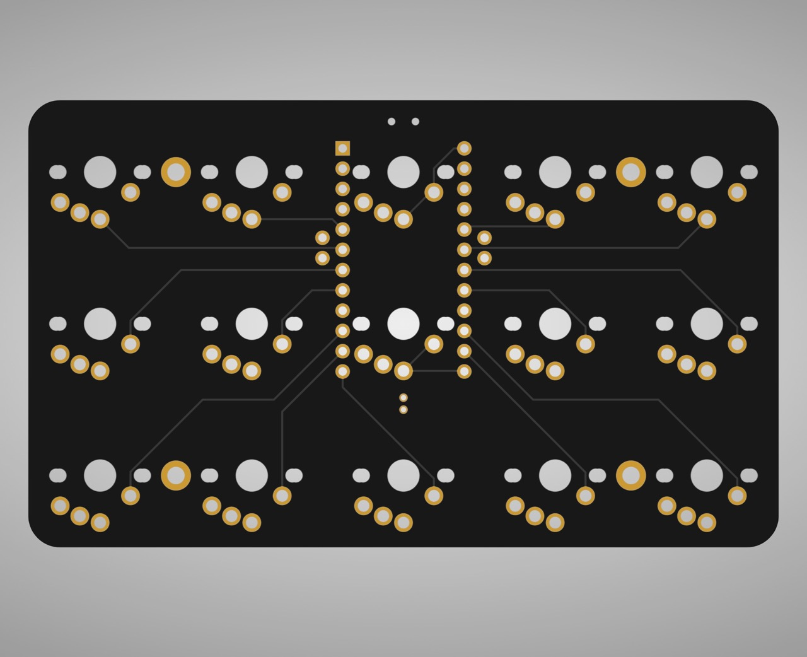
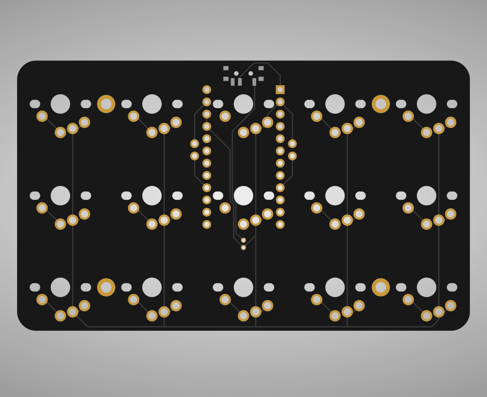
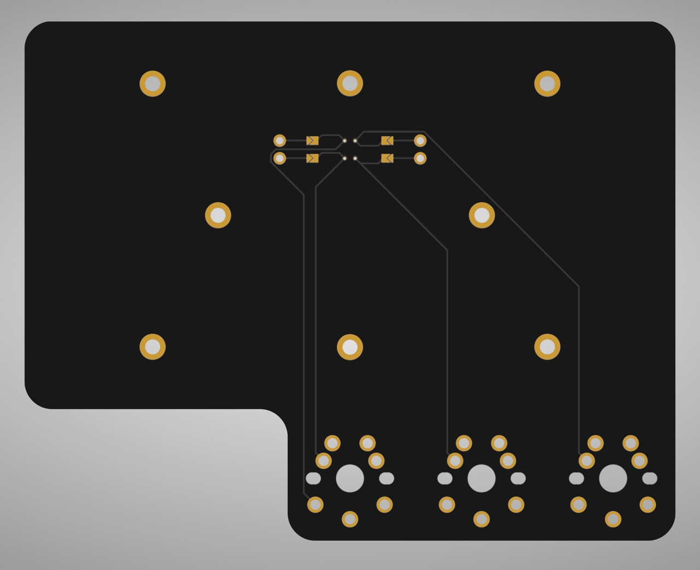
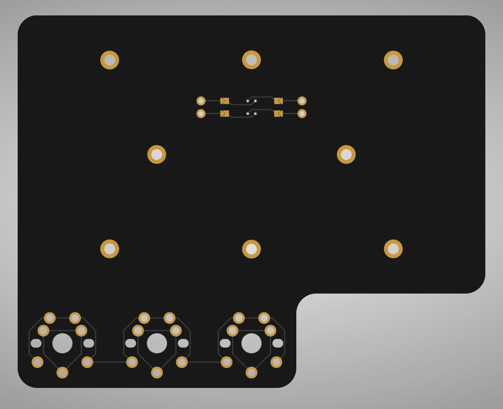

# PCB

These PCBs were provided by PCBWay in exchage for an honest review with the following settings:

- PCB color: Black
- Surface Finish: Immersion gold (ENIG)

## Notes:

- MCU component side faces away from the board on both sides.
- Mind the wire orientation when connecting the JST connector!
- I used two 4-pin female (display) connectors cut in half in order to connect the two pcb parts. Their inner edges need to be sanded down in order to fit next to the MCU.
- Either some foam or a plate are needed to secure the switches onto the pcb securely, as the sockets used slightly raise the switches.

## PCB renders:

### Top:

### Bottom:

### Adapter Top/Left:

### Adapter Bottom/Right:

## Parts list:

- 2x JST connectors male & female ([AliExpress](https://a.aliexpress.com/_mrW9HoI))
- 2x battery
- splitkb.com:
  - 2x nice!nano v2 w/ low-profile sockets
  - 2x power switch
  - 2x Low Profile Socket Strip / 4 positions
  - 36x Choc V1/MX switches
  - 36x Choc V1/MX keycaps
  - 72x Mill-Max hot swap sockets (type: 7305)
  - 2x tenting puck (optional)

I tried to only use parts that could be ordered from a single vendor but the JST connector from splitkb was just to big for my liking.
